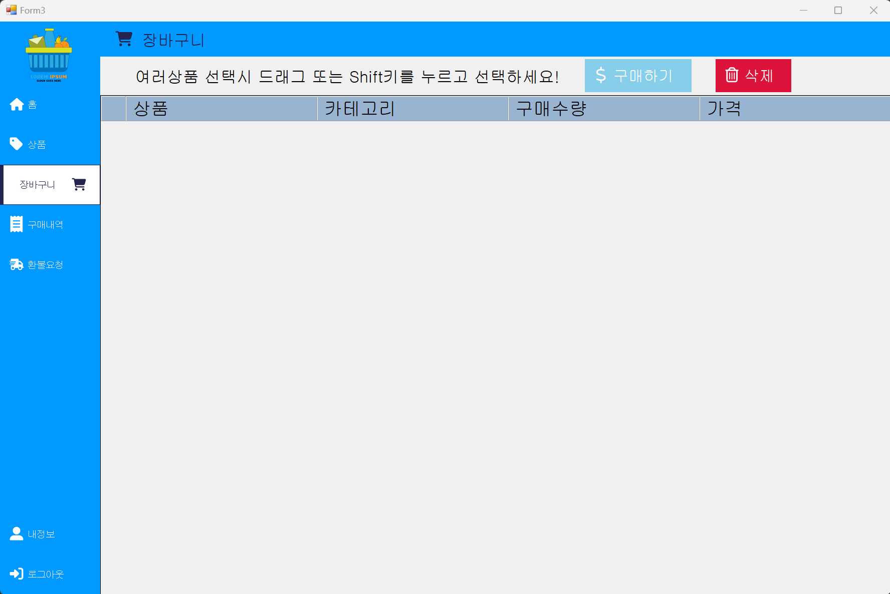
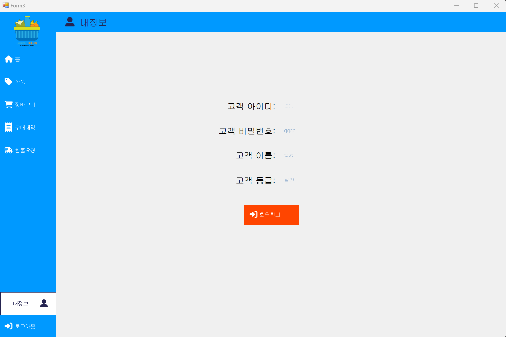

# DataBaseProgramming_FinalProject

C#을 사용하여 Visual Studio에서 Windows Forms 앱을 만들어 진행한 데이터베이스 프로그래밍 프로젝트이다.

### 3줄 요약 KeyPoint
- 데이터베이스(Database, DB)란? : 데이터의 저장소.  
- DBMS(Database Management System, 데이터베이스 관리 시스템)란? 데이터베이스를 운영하고 관리하는 소프트웨어. 계층형, 망형, 관계형 DBMS 중 대부분의 DBMS가 테이블로 구성된 관계형 DBMS(RDMBS)형태로 사용됨.   
- SQL(Structured Query Language)란? 구조화된 질의 언어라는 뜻으로 관계형 데이터베이스에서 사용되는 언어. 표준 SQL을 배우면 대부분의 DBMS를 사용할 수 있음.  

DataBase의 이론적인 부분들을 학습하고, Oracle의 DBMS를 사용해 프로젝트를 진행했다.

회원, 판매자, 관리자로 나누어서 로그인을 진행할 수 있는 로그인 페이지와 회원가입 페이지를 만들었고, 각 사용자들에 알맞는 기능을 담은 페이지들을 따로 제작하였다. 아래에는 프로젝트의 최종 완성본의 화면을 캡처한 이미지들을 첨부했다. 

* * *

## 로그인
</img>

## 회원가입
</img>

* * *
# 관리자
### 공지사항
</img>

### 고객관리
</img>

### 상품관리
</img>

### 매장판매액
</img>

### 상품판매수
</img>

### 상품판매액
</img>

* * *
# 판매자
### 판매자 홈
</img>

### 나의상품
</img>

### 판매내역
</img>

### 환불관리
</img>

### 내정보
</img>

* * *
# 회원
### 회원 홈
</img>

### 상품
</img>

### 장바구니
</img>

### 구매내역
</img>

### 환불요청
</img>

### 내정보
</img>

